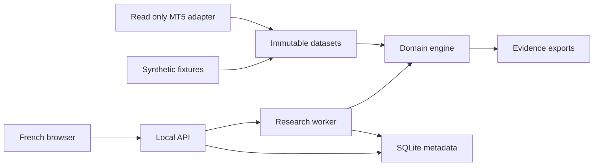

## adr_001_local_research_architecture_and_deterministic_mvp_contracts - Local research architecture and deterministic MVP contracts
> Date: 2026-09-22
> Status: Accepted
> Related request: `req_000_establish_a_reproducible_major_forex_strategy_research_mvp`
> Related backlog: (none yet)
> Related task: `task_001_orchestrate_the_major_forex_strategy_research_mvp`
> Drivers: (drivers to document)
> Reminder: Update status, linked refs, decision rationale, consequences, and follow-up work when you edit this doc.

# Overview
Use a portable deterministic research core behind a local Windows web application, with an isolated read-only MT5 data adapter.

# Context
The user selected a French local UI, Windows/MT5, three forex majors, H1/H4 signals, M1 execution, explainable templates and individual strategy comparison. No environment is configured. Simulation correctness and reproducible evidence must precede search volume.

# Decision
- Adopt the versioned defaults and semantics in `logics/discovery/mvp-development-contract.md` as the implementation baseline. Defaults are engineering choices, not claimed user account settings.
- Python domain core and FastAPI API, React/TypeScript UI, SQLite metadata, immutable compressed CSV history and JSON manifests. Lock compatible dependencies in the foundation slice.
- Build synthetic mode first; isolate MT5 imports behind the Windows adapter. Keep real-terminal validation as a delivery gate.
- One local worker, bounded search, explicit data approximation and holdout access history. No execution adapter.

# Drivers and alternatives
- A Windows-only engine would prevent portable tests; an isolated adapter retains direct MT5 access while permitting Linux development.
- A hosted service or distributed queue adds deployment work with no single-user MVP benefit.
- Tick simulation and unrestricted genetic programs expand data and correctness requirements beyond the confirmed V1.

# Consequences
- M1 spread reconstruction and conservative same-bar exits remain approximations, clearly reported.
- Synthetic completion does not prove broker-history coverage or Windows integration.
- Engineering defaults are configurable and versioned; broker-specific inputs cannot silently inherit fixture costs.
- The initial single-worker design favors deterministic reference behavior over throughput.

# Overview diagram

# References
- Related request: `req_000_establish_a_reproducible_major_forex_strategy_research_mvp`
- Related backlog: (none yet)
- Related task: `task_001_orchestrate_the_major_forex_strategy_research_mvp`
